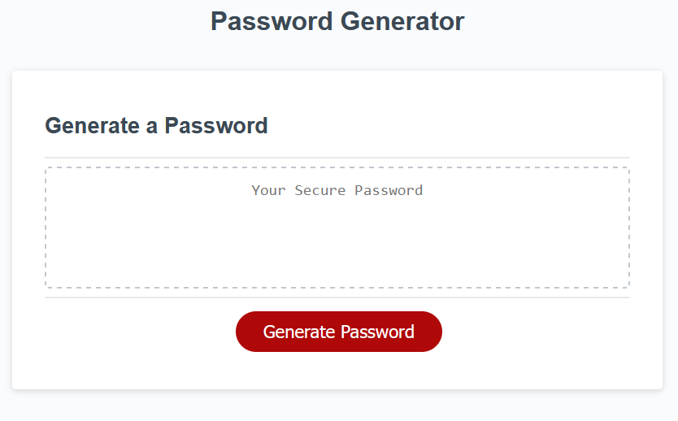
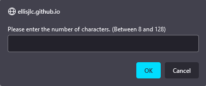
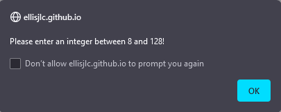
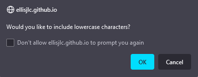
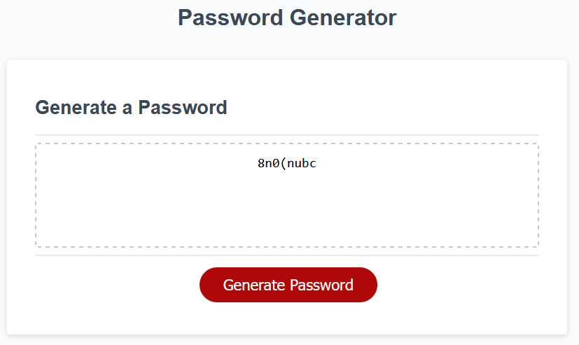

# JavaScript: Password Generator

## Introduction
A simple program run to generate passwords given specified criteria.

## Table of Contents
1. [Motivation](#motivation)
2. [Images](#images)
3. [Installation](#installation)
4. [Credits](#credits)
5. [License](#license)

## Motivation
To practice the use of JavaScript and its applications.

## Images
- First screen

- Asks for password length upon clicking the "Generate password" button

- Produces error if no input or invalid input

- Asks for confirmation to generate certain character types, ie. lowercase letters

- Returns password in the provided box

## Installation
1. Run index.html file through browser of choice.
2. Select "generate password" button.
3. Input number of characters for password to be generated.
4. Confirm or deny criteria (requires at least one criteria confirmed).
5. Password is generated into the output password box.

## Credits
Starting HTML, CSS, and JavaScript provided by Xandromus https://github.com/coding-boot-camp

## License
© 2022 Trilogy Education Services, LLC, a 2U, Inc. brand. Confidential and Proprietary. All Rights Reserved.
